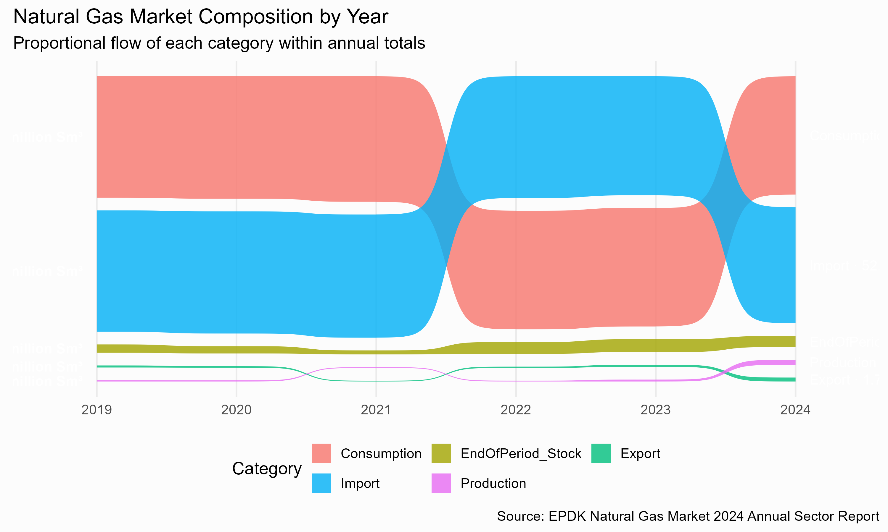

# Plots

A collection of R‐generated visualizations produced with ggplot2, ggsankey, and other packages.

## Contents

- **natural_gas_sankey.png**  
  Sankey bump chart showing Turkey’s natural gas market composition (2019–2024).  



## How to Recreate

```r
# 1) Install dependencies (if not already installed)
if (!require(devtools)) install.packages("devtools")
devtools::install_github("davidsjoberg/ggsankey")

# 2) Load libraries
library(tibble)
library(dplyr)
library(tidyr)
library(ggplot2)
library(ggsankey)
library(shadowtext)
library(scales)

# 3) Source or run your plotting script
#    e.g., source("natural_gas_sankey.R")

# 4) Save the plot
ggsave(
  filename = "natural_gas_sankey.png",
  plot     = final_plot,     # make sure 'final_plot' is in your environment
  width    = 10,
  height   = 6,
  units    = "in",
  dpi      = 300
)
